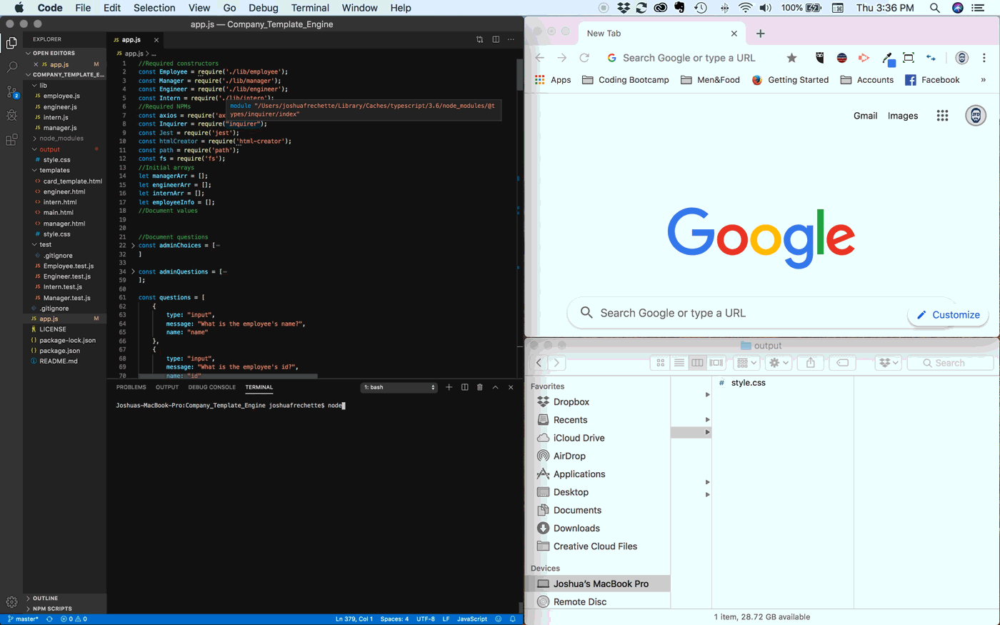

<h1 align="center">Company Template Engine<h1>

UofT SCS Coding Bootcamp | Lesson 10

# User Story

As a manager
I want to generate a webpage that displays my team's basic info
so that I have quick access to emails and GitHub profiles

# Overview

The Company Template Generator creates a command-line application that allows a manager to create a web page for their team. The allows for one manager card and as many engineer and intern cards as necessary. The cards contain basic information (name, ID#, role) and one more element depending on the employees role (Office Number for the manager, GitHub username for the Engineers, and the school attended by the interns).

This application uses [Inquirer npm package](https://github.com/SBoudrias/Inquirer.js/) to prompt the user for their email, id, and specific information based on their role with the company.

# User Directions

This app is a CLI and the user must use "node app.js" to start. The CLI Inquirer will begin by asking the manager (presumably the user) for their <u>basic information</u>, including:
 * Name
 * Employee ID#
 * Employee Email

This basic information will be asked for every employee position. 

After confirming this information, the app whether the user wishes to add an employee to the team or to create the team's HTML page. If the user chooses to create the HTML page, then the program is complete. If the user selects to add members to the team, then the CLI will ask the user to identify themselves as a manager or not. If the user is a manager, the user will be prompted to provide their:
* Office#

If the user selects to add members to the team, the app will ask for their <u>basic information</u> and
 * If the role is for an engineer, their GitHub username
 * If the role is for an intern, their school

# Deployment Links

https://joshfrechette.github.io/UofT_CompanyTemplateEngine/

# Preview

# Portfolio

https://joshfdesign-react-portfolio.herokuapp.com/

# License

MIT License

Copyright (c) 2019 Josh Fréchette

Permission is hereby granted, free of charge, to any person obtaining a copy of this software and associated documentation files (the "Software"), to deal in the Software without restriction, including without limitation the rights to use, copy, modify, merge, publish, distribute, sublicense, and/or sell copies of the Software, and to permit persons to whom the Software is furnished to do so, subject to the following conditions:

The above copyright notice and this permission notice shall be included in all copies or substantial portions of the Software.

THE SOFTWARE IS PROVIDED "AS IS", WITHOUT WARRANTY OF ANY KIND, EXPRESS OR IMPLIED, INCLUDING BUT NOT LIMITED TO THE WARRANTIES OF MERCHANTABILITY, FITNESS FOR A PARTICULAR PURPOSE AND NONINFRINGEMENT. IN NO EVENT SHALL THE AUTHORS OR COPYRIGHT HOLDERS BE LIABLE FOR ANY CLAIM, DAMAGES OR OTHER LIABILITY, WHETHER IN AN ACTION OF CONTRACT, TORT OR OTHERWISE, ARISING FROM, OUT OF OR IN CONNECTION WITH THE SOFTWARE OR THE USE OR OTHER DEALINGS IN THE SOFTWARE.